<p align="center">
  
</p>

<p align="center">
  
</p>

<br>

<h1 align="center">Hi 👋, I'm Shubham Srivastava</h1>

<p align="center">
  <strong>B.Tech CSE • Cyber Security • Software Developer</strong>
</p>

<p align="center">
  <a href="https://github.com/shubhamsrivastava08">
    
  </a>
  <a href="https://www.linkedin.com/in/shubham-srivastava-515730326/">
    
  </a>
  <a href="mailto:srivastavashubham680@gmail.com">
    
  </a>
</p>

---

## 👨‍💻 About Me

I'm a **final-year B.Tech Computer Science Engineering student specializing in Cyber Security**, with a strong interest in software development, Python, Data Structures & Algorithms, Linux, and cybersecurity.

I enjoy building practical projects, solving programming problems, exploring new technologies, and continuously improving my development skills.

```python
class ShubhamSrivastava:

    def __init__(self):
        self.name = "Shubham Srivastava"
        self.education = "B.Tech CSE • Cyber Security"
        self.location = "Kolkata, India"
        self.interests = [
            "Software Development",
            "Python",
            "Data Structures & Algorithms",
            "Cybersecurity",
            "Linux",
            "Problem Solving"
        ]

    def current_focus(self):
        return [
            "Improving DSA",
            "Building real-world projects",
            "Learning backend development",
            "Strengthening cybersecurity skills"
        ]
```

---

## 🚀 What I'm Currently Working On

* 🔭 Building practical software and cybersecurity projects
* 🧠 Improving **Data Structures & Algorithms**
* 🐍 Strengthening my **Python development** skills
* 🐧 Exploring **Linux and cybersecurity tools**
* 💻 Working with **C++, Java, Python and SQL**
* 📚 Preparing for **GATE 2027**
* 🌱 Learning new technologies through real-world projects

---

## 🛠️ Tech Stack

### Languages

<p>
  
</p>

### Development

<p>
  
</p>

### Database

<p>
  
</p>

### Cybersecurity & Systems

<p>
  
</p>

**Also exploring:**

`Nmap` • `Scapy` • `Hping3` • `SMBclient` • `SQL Injection` • `Cryptography` • `Network Security`

---

## 📌 Featured Projects

### 🏫 CampusPilot

A college ERP-style management application designed to manage academic information through a centralized interface.

**Features**

* Student Management
* Faculty Management
* Attendance
* Subjects
* Marks
* Role-based Login
* Dashboard & Analytics
* PDF Report Generation
* SQLite Database

**Tech:** `Python` `CustomTkinter` `SQLite` `Pandas` `Matplotlib` `ReportLab`

---

### ⚙️ Priority Scheduling Simulator

An Operating Systems project implementing **Preemptive and Non-Preemptive Priority Scheduling**.

**Features**

* Process scheduling simulation
* Waiting time calculation
* Turnaround time
* Completion time
* Gantt chart visualization
* GUI implementation

**Tech:** `C/C++` `Java Swing` `Python` `Tkinter` `Matplotlib`

---

### 🔐 Anti-Theft Application

A mobile security project designed around device-theft protection and system security concepts.

**Focus:** Mobile Security • System Security • Device Protection

---

### 🤖 Andrio Robot

An academic robotics project developed as an early hands-on engineering project.

**Focus:** Robotics • Electronics • Programming

---

## 💻 Problem Solving

I regularly practice programming and focus on improving:

```text
Data Structures
Algorithms
Problem Solving
Time & Space Complexity
Object-Oriented Programming
Database Concepts
Operating Systems
Computer Networks
```

---

## 🧠 Currently Learning

```text
Advanced DSA
        ↓
Backend Development
        ↓
Cybersecurity
        ↓
Linux & Networking
        ↓
Cloud & DevOps
```

---

## 📊 GitHub Activity

<p align="center">
  
  
</p>

<p align="center">
  
</p>

---

## 🎯 2026 Goals

* [ ] Become stronger in DSA
* [ ] Build more real-world projects
* [ ] Improve software development skills
* [ ] Strengthen cybersecurity fundamentals
* [ ] Contribute to open source
* [ ] Get a software development internship
* [ ] Prepare seriously for GATE 2027

---

## ⚡ A Little More About Me

```text
🎓  B.Tech CSE • Cyber Security
📍  Kolkata, India
💻  Software Development
🐍  Python Developer
🔐  Cybersecurity Enthusiast
🧠  DSA & Problem Solving
🐧  Linux Learner
🎮  Gamer
🚀  Always building & learning
```

---

## 🤝 Let's Connect

<p align="center">

<a href="https://github.com/shubhamsrivastava08">

</a>

<a href="https://www.linkedin.com/in/shubham-srivastava-515730326/">

</a>

<a href="mailto:srivastavashubham680@gmail.com">

</a>

</p>

<p align="center">
  <i>"Learn. Build. Break. Fix. Repeat."</i>
</p>

<p align="center">
  ⭐ Thanks for visiting my profile!
</p>

